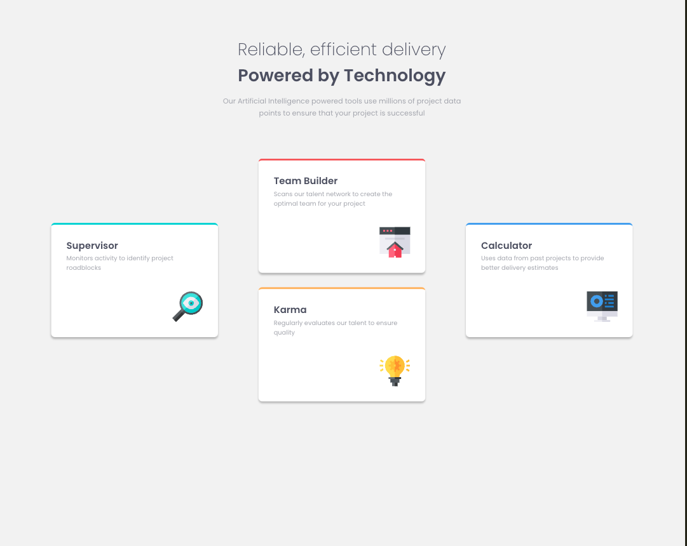
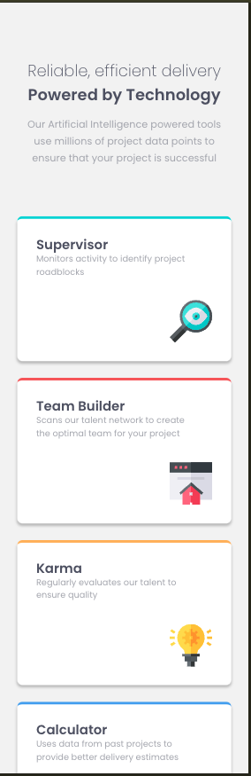

# Frontend Mentor - Four card feature section solution

This is a solution to the [Four card feature section challenge on Frontend Mentor](https://www.frontendmentor.io/challenges/four-card-feature-section-weK1eFYK). Frontend Mentor challenges help you improve your coding skills by building realistic projects. 

## Table of contents

- [Overview](#overview)
  - [The challenge](#the-challenge)
  - [Screenshot](#screenshot)
  - [Links](#links)
- [My process](#my-process)
  - [Built with](#built-with)
  - [What I learned](#what-i-learned)
  - [Continued development](#continued-development)
  - [Useful resources](#useful-resources)
- [Author](#author)

## Overview 🔭

### The challenge

This challenge displays four cards using grid layout. On mobile devices the grid layout makes use of implicit grid layout with 1 column and on bigger screens the solution implements explicit grid layout with 3 columns and 2 rows.

### Screenshot 📷
DeskTop View

Mobile View

### Links 🔗

- Solution URL: [GitHub Solution](https://github.com/ownedbyanonymous/four-card-feature-section-master)
- Live Site URL: [Live Site](https://four-card-feature-sectio-git-d15b91-anonymous-projects-2a5e58cd.vercel.app/)

## My process

### Built with 🧱

- Semantic HTML5 markup
- Flexbox
- CSS Grid
- Mobile-first workflow

### What I learned 📖

- Using mobile first workflow which is usually path of least resistance
- Using Grid Layout
- Flexbox Layout
- Implementing semantic HTML tags which are tags that relay meaning to both the broweser and developer

### Continued development 📚

Focus areas:
- Grid Layout

### Useful resources 📚

- [Resource 1](https://www.joshwcomeau.com/css/interactive-guide-to-grid/#alignment-9) - This resource critical in my understanding of grid layout and was my point of reference while building my solution.

## Author ✍🏾

- Frontend Mentor - [@ownedbyanonymous](https://www.frontendmentor.io/profile/ownedbyanonymous)

